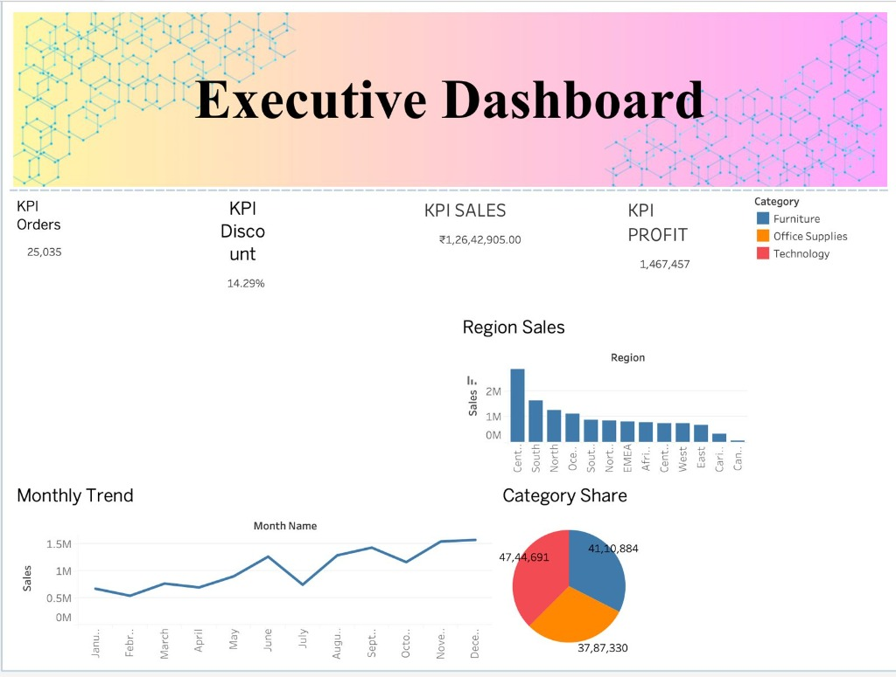
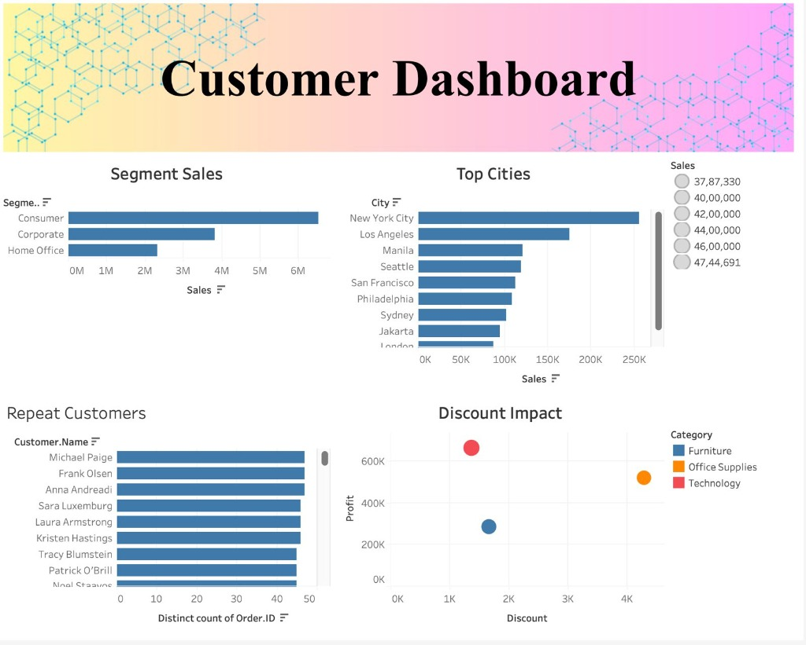
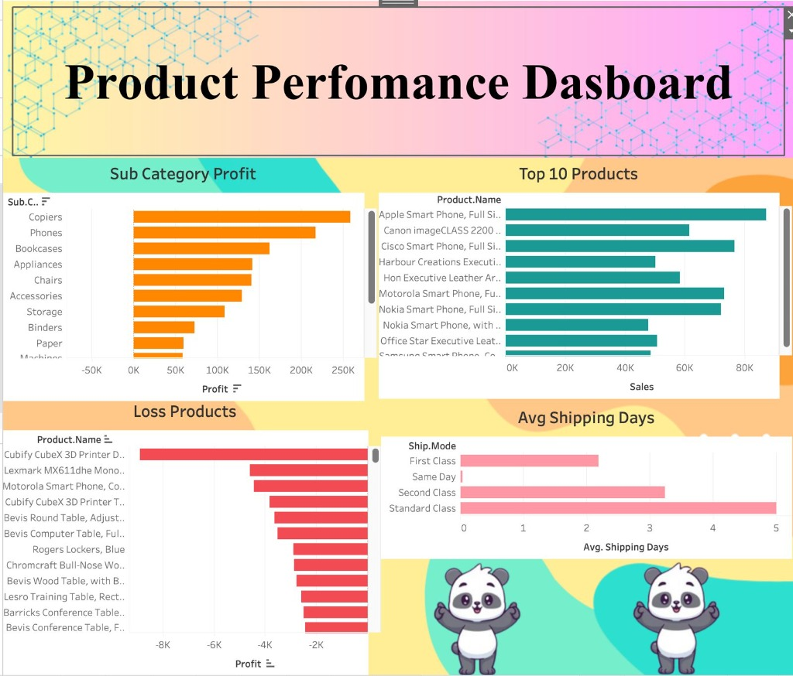

# Tableau Dashboard Links

## Global Superstore: Sales Performance & Profitability Dashboard

**Tableau Public URLs**: 
- **Executive Dashboard**: [View on Tableau Public](https://public.tableau.com/views/5-7_Capstone/ExecutiveDashboard?:language=en-US&publish=yes&:sid=&:redirect=auth&:display_count=n&:origin=viz_share_link)
- **Product Performance Dashboard**: [View on Tableau Public](https://public.tableau.com/app/profile/sudip.prasad/viz/5-7_Capstone/ProductPerformanceDashboard?publish=yes)

### Dashboard Features
Based on the latest visualisations, the Tableau workbook is structured into three primary dashboards providing a comprehensive view of the Superstore's performance:

1. **Executive Dashboard**
   - **KPI Cards**: Total Orders, Average Discount, Total Sales, Total Profit.
   - **Region Sales**: Sales distribution across different regions.
   - **Monthly Trend**: Time-series analysis of sales over months.
   - **Category Share**: Proportion of sales across Furniture, Office Supplies, and Technology.

2. **Customer Dashboard**
   - **Segment Sales**: Revenue breakdown by Consumer, Corporate, and Home Office.
   - **Top Cities**: Highest performing cities by sales volume.
   - **Repeat Customers**: Ranking of most frequent buyers.
   - **Discount Impact**: Scatter plot analyzing the correlation between discount levels and profitability.

3. **Product Performance Dashboard**
   - **Sub-Category Profit**: Profitability rankings across all sub-categories.
   - **Top 10 Products**: Best-selling individual products.
   - **Loss Products**: Products negatively impacting overall profit margins.
   - **Avg Shipping Days**: Shipping efficiency breakdown by shipping mode (First Class, Same Day, Second Class, Standard Class).

### Additional Visualizations
The project also includes deep-dive individual worksheets for:
- **Geographic View**: Country Map visualizing global sales distribution.
- **Detailed Trends**: Standalone Monthly Trend and Region Sales charts.

---

### Screenshots

#### 1. Executive Dashboard

#### 2. Customer Dashboard

#### 3. Product Performance Dashboard

*(See the `tableau/screenshots/` folder for individual chart exports including Country Map, Discount Impact, and more).*
